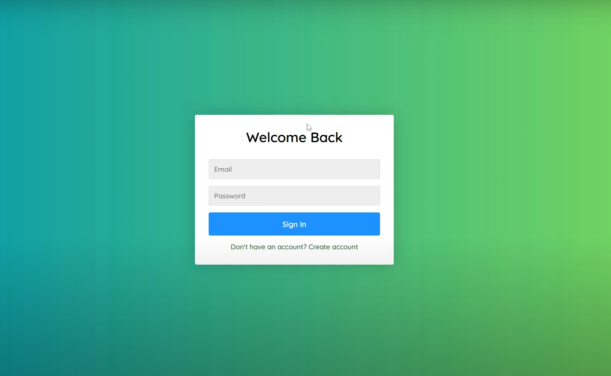
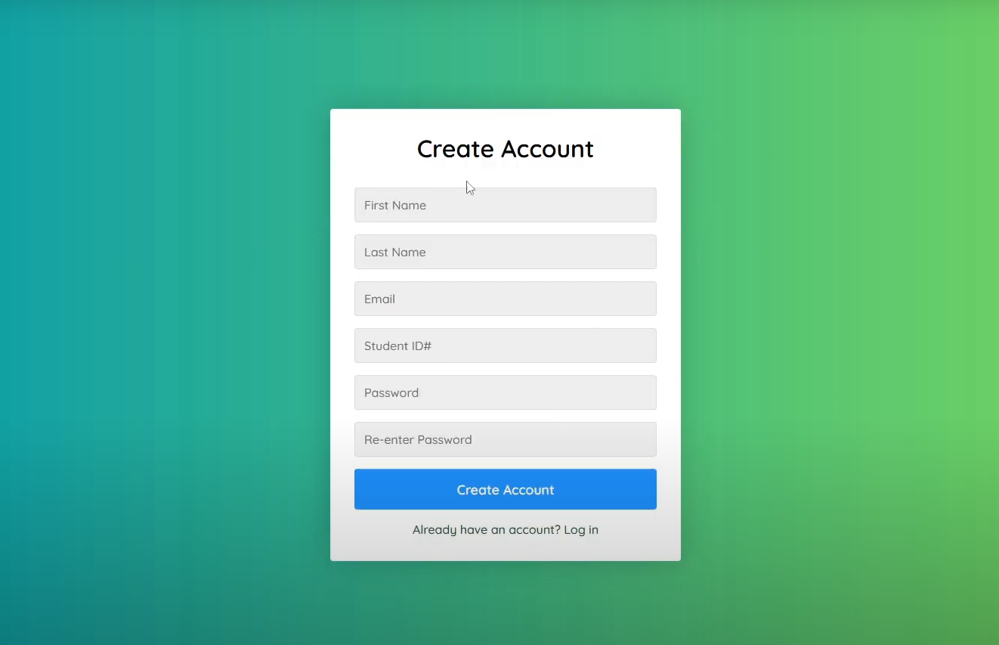
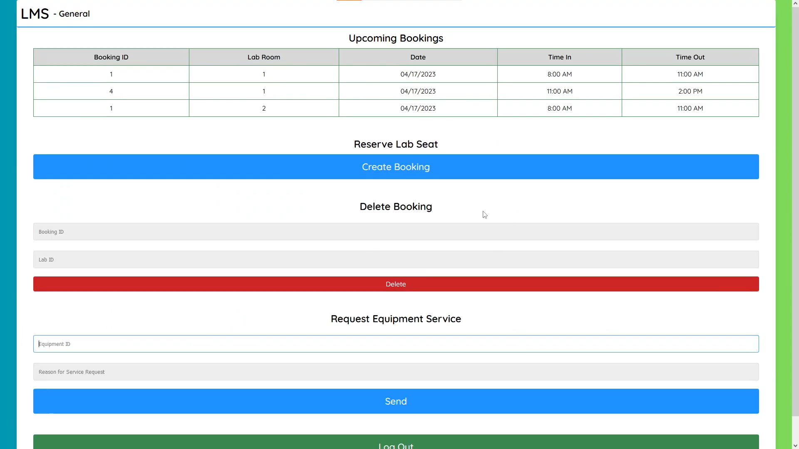
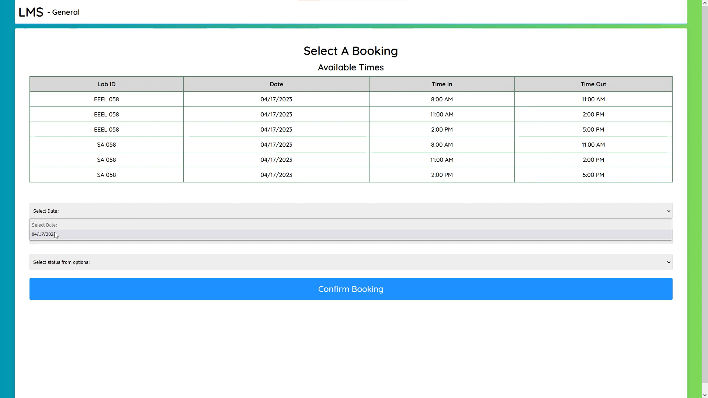
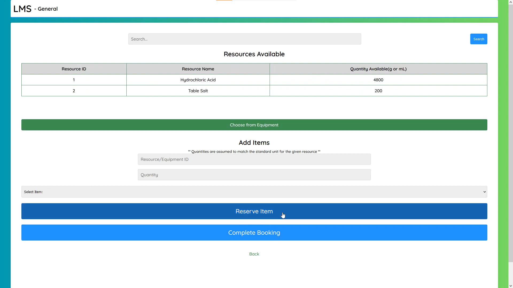
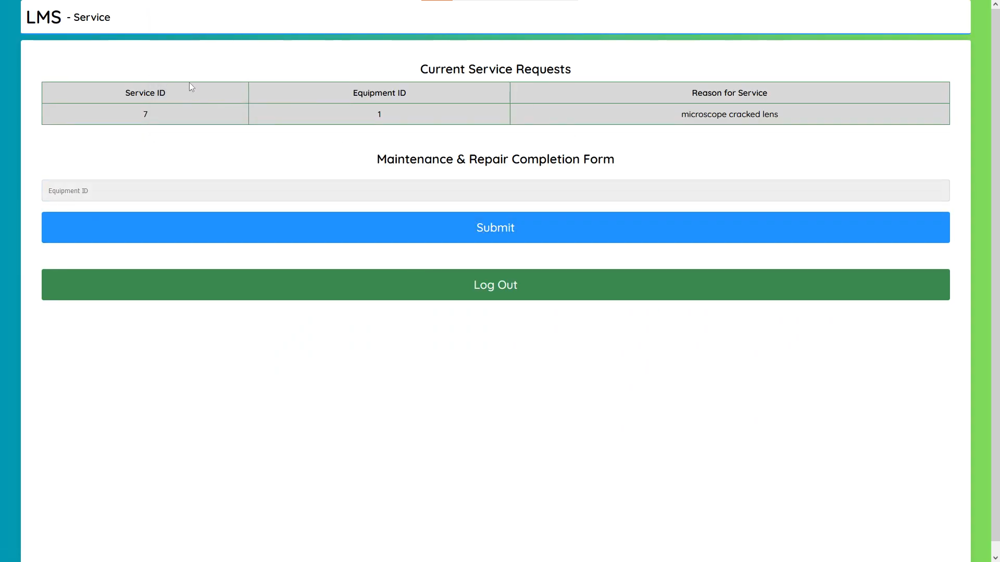
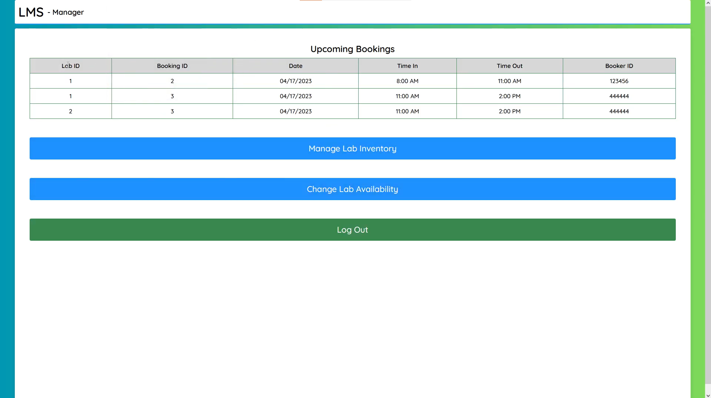
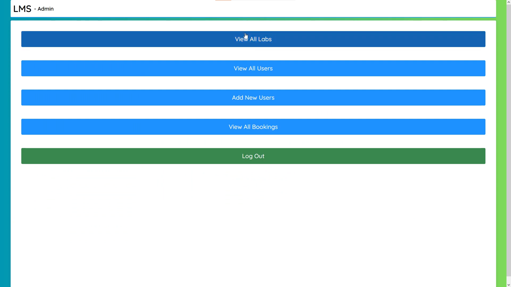

# University Equipment Booking

## Group Members 

- Alexey Grekov
- Courtney Lenz
- Abbiraam Manchiraju

## About

Web-based project solution for the CPSC 471 class to improve the methods universities use for booking labs. In this application student users can reserve time slots in a lab, reserve equipment/resources and report damaged equipment to the maintenance staff. Maintenance users can remove equipment items by their ID from the database and reinsert them once repaired. Lab Managers can update resources and equipment within the database after registering. Lastly Admin users have the ability to add/remove different types of users, view all labs, users and booking. The tools used were JavaScript, HTML, CSS for front end and for back end we used MySQL with Java queries which was hosted on AWS. Orignial project was done on Eclipse then put onto private Github repo.

## Demo
Some of the primary pages are below

Home page to login

Account creation

Student view

Student bookings

Page to let students reserve equipment and resources

Maintenancec User

Lab Manager

Admin view

